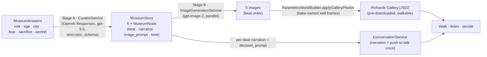

# Visual Eyes

> Ask who you want to become, and walk a five-room museum that shows that future **honestly** — mostly its cost, not its glory — then hands the choice back to you.

**Status:** 🛠️ Future Museum prototype (in development) · Apple Foundation Program project + personal portfolio

---

## What it is

Most balance/wellness apps ask *"how do you feel today?"* and offer an escape — an ethereal beach to relax on. **Visual Eyes asks "who do you want to become?"** and does the opposite: it builds a short documentary of that path and lets you walk through it in 3D.

You answer a few questions about an aspiration. An AI "Curator" writes a five-beat Hero's-Journey story of that life — **four rooms of its quiet cost, one room of its summit** — and paints an image for each. You then step into a pre-downloaded 3D museum and walk past your own five images while a documentary voice narrates each one. At the exit it asks a single question and hands the decision back to you.

**Reframed thesis:** balance is **not** a beach you escape to. It's the steadiness of having seen the full cost of a path and still choosing it — or clearly choosing *not* to. Misalignment is chasing a fantasy you never examined, or fleeing a calling out of fear. You can't align with a *future* you've never honestly looked at.

Inspired by the *7 Up / Up* documentary series: plain, unsentimental, second-person.

---

## Demo flow

```
Questions  →  "Building your museum…"  →  Walk your 3D museum  →  The decision
(who you      (Curator writes 5 beats     (5 images on the walls,    (one question,
 want to       + paints 5 images)          a voice narrates each)     the choice is yours)
 become)
```

- **Apple Vision Pro:** true immersion — you walk the museum, the Curator's voice follows you, and you can talk back to it.
- **iPad / iPhone:** first-person walkthrough of the same museum (validation without a headset).

---

## Project structure

```
Vision-Pro/
├── README.md          ← you are here
├── VisitingArtisan.xcodeproj   (Xcode project/target still named VisitingArtisan; product is "Visual Eyes")
├── Assets.xcassets    ← app assets
├── PRD.md             ← product spec + technical architecture
├── ARCHITECTURE.md    ← system architecture (deep dive)
├── SETUP.md           ← how to build & run
├── WORLDS.md          ← how the museum makes & places its images
└── Sources/           ← Swift source used by the Xcode target
    ├── Museum/        ← the Future Museum pipeline (questions → story → images)
    ├── World/         ← RealityKit gallery + parametric world builder
    ├── Voice/         ← narration + conversation for the user(STT → LLM → TTS)
    └── …
```

## The Museum pipeline

> The app has **no persistent database** — a visit lives in memory for a single session (`AppState`). The flow below is the core transform from answers to a walkable, narrated exhibition.



Pipeline in one line: **`MuseumAnswers` → `CuratorService` → `MuseumStory` → `ImageGenerationService` → 5 images → Richards Gallery USDZ walls + Curator voice** (see `Sources/Museum/` and `Sources/World/ParametricWorldBuilder.swift`).

## Getting started

See [SETUP.md](SETUP.md) — open `VisitingArtisan.xcodeproj` and run on the Apple Vision Pro or iPad simulator. Live generation needs an `openAIAPIKey` (the Curator + images); the on-device narration voice needs no key.

## Tech stack

Swift · SwiftUI · RealityKit · visionOS `ImmersiveSpace` · OpenAI (Responses + Images) · Claude (conversation) · Speech framework (STT) · `AVSpeechSynthesizer` / Azure / ElevenLabs (TTS)

## Roadmap

| Stage | Goal | Status |
|---|---|---|
| **1** | Generation pipeline: questions → Curator story → 5 images → flat gallery | ✅ done (`feat/future-museum`) |
| **2** | Bridge to the 3D walkable museum + Curator voice (narration + conversation) | 🔵 in progress |
| **3** | Voice input on the questions · streaming generation ("walk = loading bar") · cross-image style-lock | ⬜ next |
| **4** | Deploy on Apple Vision Pro hardware | ⬜ later |

## Documentation

- [PRD.md](PRD.md) — product requirements, flow, question design, story model, phasing
- [ARCHITECTURE.md](ARCHITECTURE.md) — system architecture & data flow
- [SETUP.md](SETUP.md) — build & run
- [WORLDS.md](WORLDS.md) — how the museum makes & places its images
