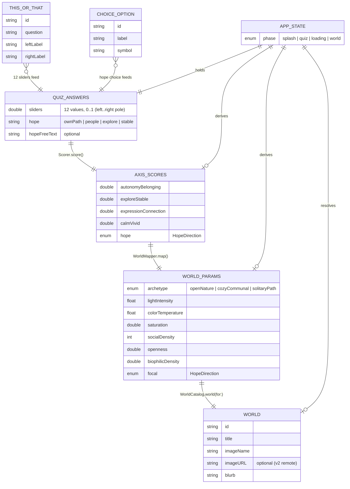

# Visiting Artisan

> An Apple Vision Pro app that helps university students understand who they are — by guiding them through a personalised quiz and immersing them in a world that reflects their authentic self.

**Status:** 🛠️ v1 prototype (in development) · Apple Foundation Program project + personal portfolio

---

## What it is

Most balance/wellness apps ask *"how do you feel today?"* — Visiting Artisan asks **"who are you?"**

You answer a short quiz across three dimensions (Emotional · Cultural · Physical), and the app generates a personalised immersive 360° world you can step into — so you can *feel*, not just understand, what your balance looks like.

**Core thesis:** Self-alignment = Balance. You can't align with a self you don't know.

---

## Demo flow

```
Splash  →  "Who are you?" Quiz  →  Building your world…  →  Your immersive world
```

- **iPad / iPhone:** look around your world by dragging (360° panorama)
- **Apple Vision Pro:** true immersion — you stand inside your world

---

## Project structure

```
Vision-Pro/
├── README.md          ← you are here
├── VisitingArtisan.xcodeproj
├── Assets.xcassets    ← app assets, including sample v1 world images
├── PRD.md             ← product spec + technical architecture
├── ARCHITECTURE.md    ← system architecture (deep dive)
├── SETUP.md           ← how to build & run
├── WORLDS.md          ← how to generate the 360° world images
└── Sources/           ← Swift source used by the Xcode target
```

## Data model

> The app has **no persistent database** — state lives in memory for a single session
> (`AppState`). The diagram below is an entity view of the core Swift types and the
> quiz → world pipeline that transforms them.



Pipeline in one line: **`QuizData` questions → `QuizAnswers` → `Scorer` → `AxisScores` → `WorldMapper` → `WorldParams` → `WorldCatalog` → `World`** (see `Sources/Models.swift` and `Sources/WorldCatalog.swift`).

## Getting started

See [SETUP.md](SETUP.md) — open `VisitingArtisan.xcodeproj` and run.
No external API needed for v1: it runs end-to-end with bundled sample images.

## Tech stack

Swift · SwiftUI · RealityKit · visionOS `ImmersiveSpace` · (v2) Skybox AI API

## Roadmap

| Stage | Goal |
|---|---|
| **v1** | Full flow runs locally (quiz → pre-baked 360° world) on iPad + visionOS simulator |
| **v2** | Live AI generation via Skybox AI API |
| **v3** | Deploy to Apple Vision Pro hardware |
| **v4 (stretch)** | Walkable 3D worlds via World Labs Marble |

## Documentation

- [PRD.md](PRD.md) — product requirements, user flow, quiz design, phasing
- [ARCHITECTURE.md](ARCHITECTURE.md) — system architecture & data flow
- [SETUP.md](SETUP.md) — build & run
- [WORLDS.md](WORLDS.md) — generating world images
